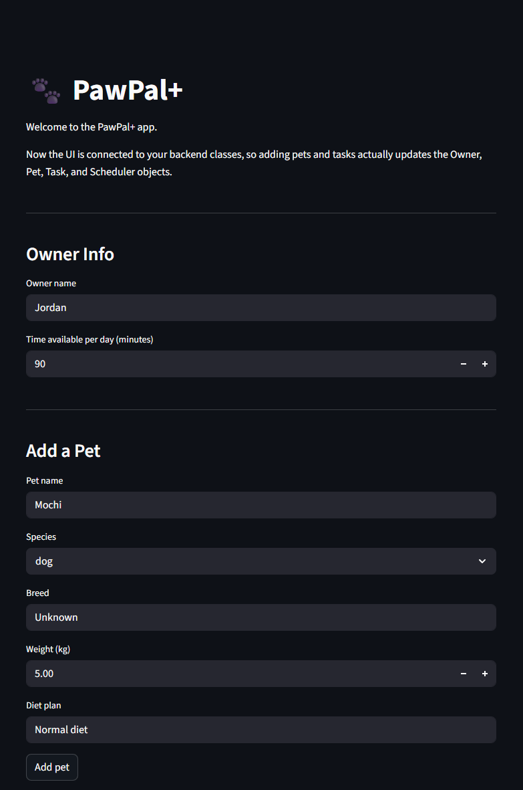
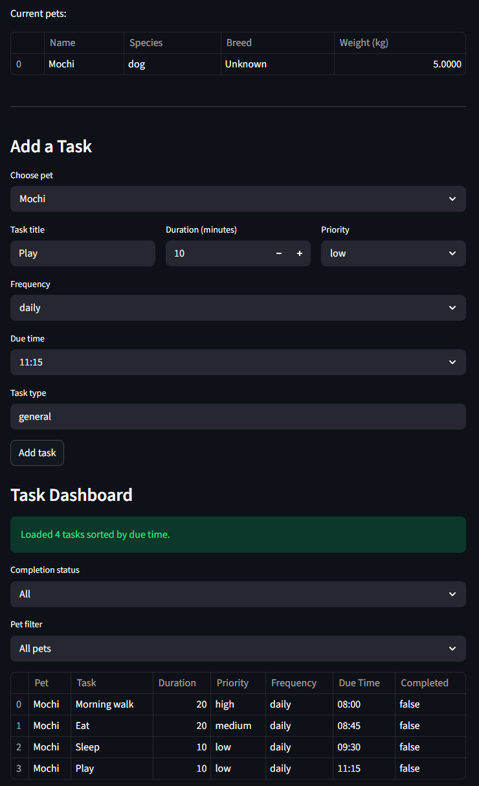
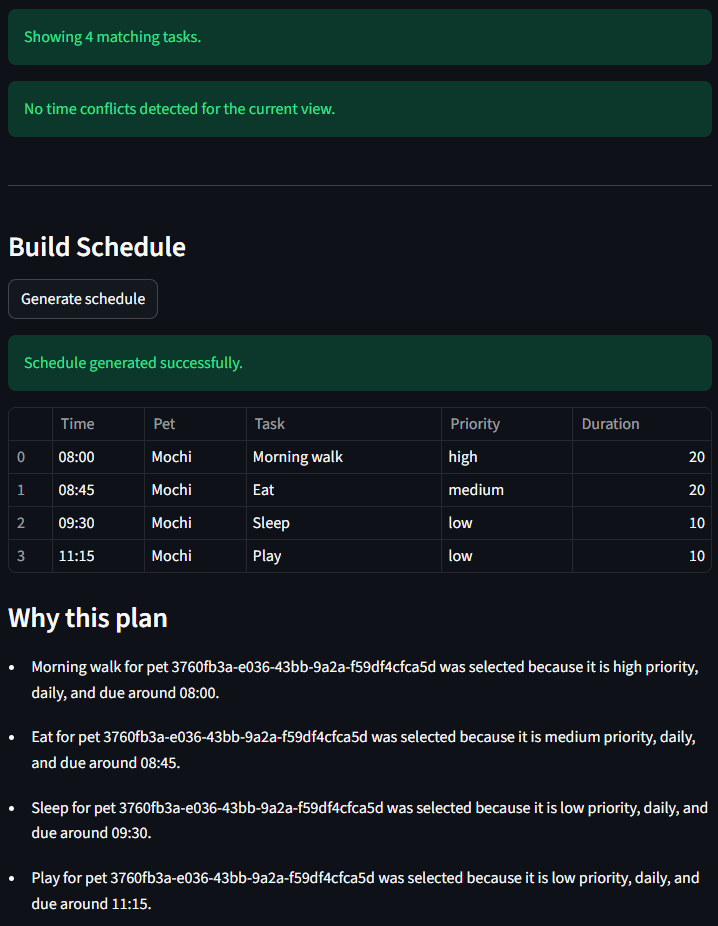

# PawPal+

PawPal+ is a Streamlit pet-care planner that helps owners organize daily tasks across one or more pets.
It combines scheduling logic, recurring task support, and conflict detection with a simple interactive UI.

## Table of Contents

- Overview
- Features
- Project Structure
- Installation
- Running the App
- How to Use
- Scheduling Rules
- Testing
- Troubleshooting

## Overview

PawPal+ is designed for owners who need a clear daily plan for recurring and one-time pet-care tasks.
The app lets you:

- Add and manage pets.
- Add care tasks with duration, priority, frequency, and due time.
- Build a daily schedule sorted chronologically.
- Detect overlapping task times and surface warnings.
- Explain why tasks were selected for the daily plan.

## Features

- Pet and task profiles, including species, breed, weight, diet plan, priority (`low`, `medium`, `high`), frequency (`once`, `daily`, `weekly`), optional due time, and completion state.
- Scheduler capabilities:
	- urgency-based ranking
	- chronological sorting
	- optional filtering by completion status and pet name
	- owner-constraint application (time and preferences)
	- recurring task generation on completion
	- time conflict detection and warning messages
- Streamlit dashboard with table-based task and schedule views.

## Project Structure

- `app.py`: Streamlit UI and user workflow.
- `pawpal_system.py`: Core domain and scheduling logic.
- `tests/test_pawpal.py`: Unit tests for core behaviors.
- `requirements.txt`: Runtime and test dependencies.

## Installation

1. Create and activate a virtual environment.

Windows (PowerShell):

```powershell
python -m venv .venv
.venv\Scripts\Activate.ps1
```

macOS/Linux:

```bash
python -m venv .venv
source .venv/bin/activate
```

2. Install dependencies.

```bash
pip install -r requirements.txt
```

## Running the App

```bash
streamlit run app.py
```

After launch, open the local URL shown in the terminal.

## How to Use

1. Update owner information and available minutes per day.
2. Add one or more pets.
3. Add tasks for each pet with duration, priority, frequency, due time, and task type.
4. Review the task dashboard:
	 - tasks are sorted by due time
	 - filters can narrow by completion and pet name
	 - conflict warnings appear when tasks overlap
5. Click `Generate schedule` to produce the daily plan.
6. Review the generated table and explanation output.

## Scheduling Rules

- **Sorting**: Tasks are displayed in chronological order by due time. Tasks without a due time are shown last.
- **Ranking**: Higher urgency tasks are prioritized based on priority, due-time pressure, and completion status.
- **Constraints**: The scheduler respects available daily minutes and optional owner preferences.
- **Recurrence**:
	- completing a `daily` task creates a new task for the next day
	- completing a `weekly` task creates a new task for the same weekday in the following week
- **Conflict Detection**: Tasks sharing the same due time are grouped and returned as warning messages.

## DEMO





## Testing

Run all tests:

```bash
pytest -q
```

The test suite covers:

- task addition and completion behavior
- sorting correctness and daily-plan order
- filtering by completion and pet name
- recurrence logic for daily and weekly tasks
- time conflict detection and warning generation

## Troubleshooting

- **Streamlit command not found**:
	- ensure your virtual environment is activated
	- reinstall dependencies with `pip install -r requirements.txt`
- **No tasks shown in schedule**:
	- confirm at least one pet and task exist
	- confirm owner available minutes are sufficient for selected tasks
- **Unexpected empty warnings**:
	- conflicts only occur when two or more tasks share the same due time

